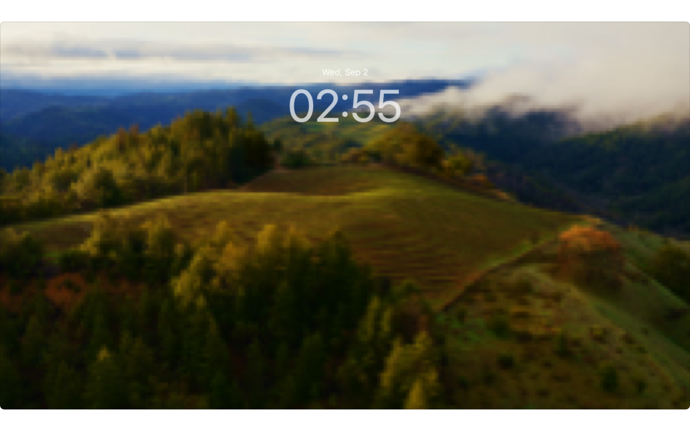
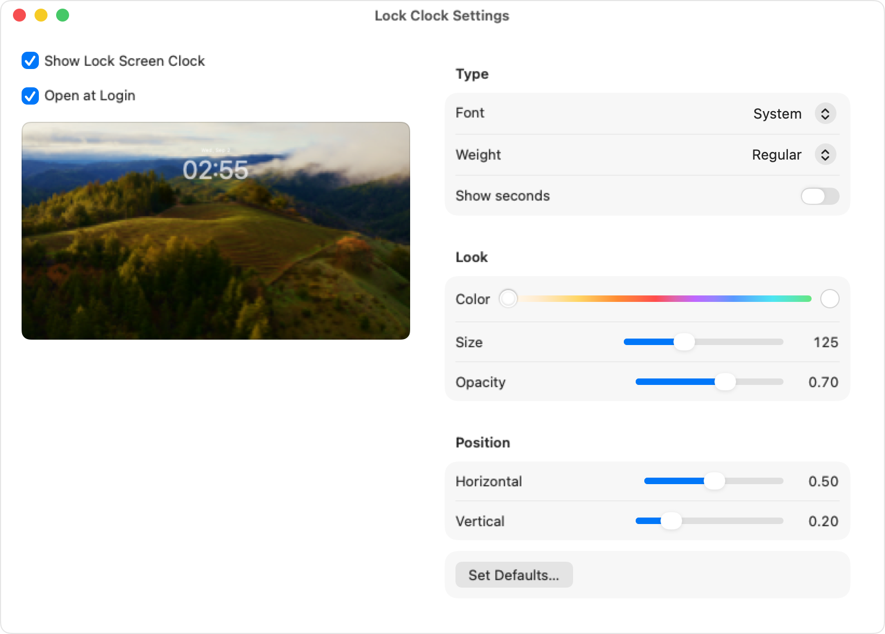
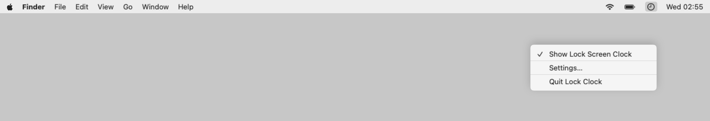

# Lock Clock

A background macOS utility that puts a **solid, classic big clock** back on the Lock Screen — no Liquid Glass, no mystery opacity, just the time you can actually read.

macOS Tahoe took away a lot of the old Lock Screen clock options, and I kept seeing people frustrated by that. So I decided to bring the classic big clock back. It is a personal AppKit agent that uses a small set of private SkyLight APIs to place a display-only window on the Lock Screen Space. It is **not** App Store compatible — private WindowServer calls and Gatekeeper warnings come with the territory.

## But why, Chris?

I liked the big clock. Then Tahoe happened, and suddenly the Lock Screen was all shiny liquid vibes (sorry but not sorry T-1000 🦾). People were asking how to get the old look back. Apple’s answer is basically: turn the large clock off, or live with what you get.

That felt unfinished. So Lock Clock draws a solid clock on top of the Lock Screen after you set **Show large clock** to **Never** (and refresh preboot so FileVault / boot / wake agree). Fonts, size, color, opacity, position — yours again. Match System Clock if you want Apple’s typeface without the glass. Keep it running from the menu bar. Lock, look at the time, unlock. Done.

If you have been staring at a Lock Screen that no longer feels like yours, this is for you!

## Download and install

You do **not** need Xcode. Download the latest `LockClock-1.0.N.zip` from [Releases](https://github.com/christos-pas/mac-os-tahoe-classic-clock/releases).

This build is **ad-hoc signed and not notarized**. There is no Apple Developer ID (sorry guys, not on the priority list right now). macOS Gatekeeper will warn you. That is expected, not a virus scan result. (source: "trust me bro!" In case you don't, just check the [Development](docs/development.md) document and build it directly from the source code).

1. In **System Settings → Wallpaper → Clock Appearance**, set **Show large clock** to **Never**. Then refresh the preboot volume and restart so the change applies on all lock screens, including FileVault unlock, boot, user switching, and the wake transition:
  ```bash
   sudo diskutil apfs updatePreboot /
  ```
   Restart the Mac after that command finishes.
2. Double-click the zip to unpack **LockClock.app**.
3. Drag it to **Applications**.
4. Open it the first time with **Control-click → Open** (or right-click → **Open**), then click **Open** in the dialog.
5. If macOS says the app is **damaged** and should be moved to the Trash, that is the quarantine flag on an unsigned download. In Terminal:
  ```bash
   xattr -d com.apple.quarantine /Applications/LockClock.app
  ```
   Then Control-click → **Open** again.
6. A clock icon appears in the menu bar. There is no Dock icon.
7. In **Settings**, enable **Classic Lock Screen Clock (Launch at Login)**.
8. Lock with **Control-Command-Q**. Unlock to hide the clock.

Quit from the menu bar icon. To uninstall, quit, then drag **Lock Clock** from Applications to the Trash. If it was set to open at login, also remove it in **System Settings → General → Login Items**.

Do not run a copy from Downloads long-term. Use `/Applications`.

## Requirements

- macOS Tahoe **26.6.2** (build 25G83) or a close Tahoe release
- Apple Silicon (verified on `arm64`)
- Ability to turn off Apple’s large Lock Screen clock in **System Settings → Wallpaper → Clock Appearance** (set **Show large clock** to **Never**), then run `sudo diskutil apfs updatePreboot /` and restart so preboot screens pick up the change

No Accessibility permission, Screen Recording permission, root (except the optional preboot refresh above), or SIP change is required.

## Screenshots







## Appearance

Open **Settings…** from the menu bar clock icon to change font, weight, size, color, opacity, position, and seconds. Optional **Match System Clock** follows Clock Appearance from System Settings.

## Known limitations

- Private SkyLight APIs can change in a future macOS update.
- Not App Store compatible.
- The app must keep running; quitting removes the clock.
- Fast User Switch hides the clock; it is not shown on another user’s session.
- Placement may need a small tweak on unusual displays.

Want to send a fix or a feature? See [Contributing](CONTRIBUTING.md). Hacking or cutting a release? See [Development](docs/development.md).

## License

[MIT](./LICENSE) © [Christos S. Paschalidis](https://github.com/christos-pas)

[christos.paschalidis.dev@gmail.com](mailto:christos.paschalidis.dev@gmail.com)

